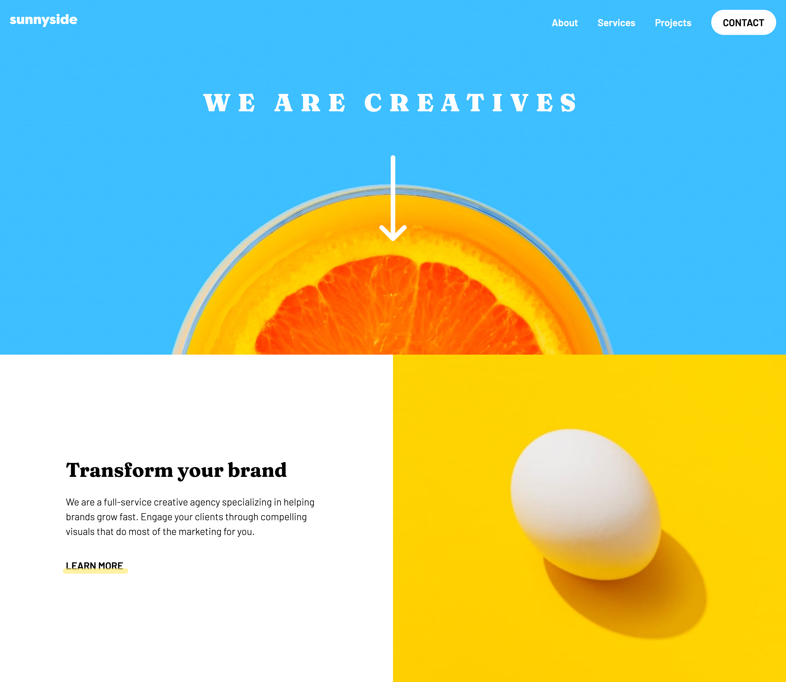

# Frontend Mentor - Sunnyside agency landing page solution

This is a solution to the [Sunnyside agency landing page challenge](https://www.frontendmentor.io/challenges/sunnyside-agency-landing-page-7yVs3B6ef) on Frontend Mentor

## Table of contents

-  [Overview](#overview)
   -  [The challenge](#the-challenge)
   -  [Screenshot](#screenshot)
   -  [Links](#links)
-  [My process](#my-process)
   -  [Built with](#built-with)
   -  [What I learned](#what-i-learned)
   -  [Continued development](#continued-development)
   -  [Useful resources](#useful-resources)
-  [Author](#author)
-  [Acknowledgments](#acknowledgments)

## Overview

### The challenge

Your users should be able to:

-  View the optimal layout for the site depending on their device's screen size
-  See hover states for all interactive elements on the page

### Screenshot



### Links

-  Live Site URL:

## My process

### Built with

-  Semantic HTML5 markup
-  Mobile-first workflow
-  CSS Grid
-  Flexbox
-  Javascript

### What I learned

```html
<a href="/" aria-label="Sunnyside logo"
   ></a>

<button type="button" class="hamburger-btn">
   
</button>
```

This project was my first time building a navigation for both mobile and wider viewports, introducing the classic hamgburger icon to toggle the mobile navigation whilst rendering it invisible on larger screens. I quickly learned the importance of making such a toggle accessible by wrapping it in a `<button>` with an `aria-label` attribute, providing additional context for interactive elements housing no text content.

```js
const innerWidth = () => window.innerWidth

header.addEventListener('click', (e) => {
   if (innerWidth() <= 1000) {
      if (e.target.matches('#hamburger-icon')) {
         e.preventDefault()
         nav.classList.toggle('hidden')
      }
   }
})
```

In order to toggle the visibility and behaviour of the mobile navigation, I decided to create a JavaScript media query equivalent by running a function that retrieved the viewports inner width whenever the desired event was fired (on resize or click).

```css
main {
   grid-template-rows:
      minmax(300px, auto) minmax(300px, auto) auto minmax(300px, auto)
      repeat(2, auto)
      1fr minmax(460px, auto);
   grid-template-areas: ...;
}
```

This was my first project using Grid to layout the whole site, where I learnt the importance of using both px and the `auto` keyword within the `minmax()` function, creating responsive containers that adapted to future content additions. When using grid-areas to control the placement of content, it allows changing the order at different breakpoints to be much easier and more flexible than other layout methods.

```css
.main-nav::before {
   clip-path: polygon(100% 1%, 0% 100%, 100% 100%);
}
```

In order to create the triangle shape on top of the mobile navigation, I had to learn about the `clip-path` property that allows us to create any shape desired based on a collection of set points. In practice, there are multiple useful sites that will help generate these shapes for you through an interface similar to Adobe Photoshop.

```css
.cherry img,
.orange img,
.wine img,
.egg img {
   max-width: 100%;
   display: block;
}
```

All the images in this project provided a very nice challenge in regards to controlling how they responded, as there was such a diverse range in terms of their design implementations. When setup as background-images, the primary images caused overlapping problems with the text content that was positioned in front of them. The solution I've referenced in this repo helped me to alleviate this issue by positioning the text over the image and rendering the image directly in the HTML instead of in the background.

```css
.profile-img {
   width: 70px;
}
```

The profile images in the testimonials section were becoming too large and uneven in their sizing as the viewport increased, especially when the last flex child responded to fill the entire viewport width at tablet devices. Once again, the solution helped me solve this problem by applying a fixed px width to each image.

### Continued development

I would like to continue using grid to create full-page layouts, as well as experimenting with other situations where currently I might not think to use it.

Numerous problems occured with the hover states of the social icons within the footer, as the `fill` colour would not change when hovering within the gaps of the original shape. In the future, I would like to learn how to use NPM to install Font Awesome's icon package, which supposedly has greater built JavaScript support to fix those hover problems.

### Useful resources

-  [CSS Centering Complete Guide](https://css-tricks.com/centering-css-complete-guide/) - This article helped me with regards to centering the mobile navigation as the viewport grew wider. The `translate(50%, -50%)` centering method works very nicely when positioning content, and as such will become incredibly useful for future projects.

## Author

-  Website - [Joshua Jameson-Wallis](https://joshuajamesonwallis.com)
-  Linkedin - [Joshua Jameson-Wallis](https://www.linkedin.com/in/joshua-jameson-wallis/)

## Acknowledgments

I have left a copy of the solution I used within this repo. This solution was featured in an email newsletter the Front End Mentor founder sent out, due its responsiveness and great taste in animation for the mobile menu and rotating orange on scroll.
